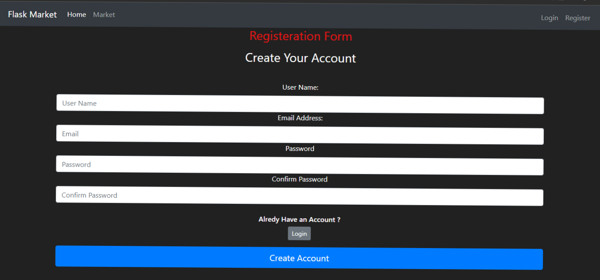

# Shubham Virtual Market
- This Project is a Virtual Market created using Flask and HTML Templates.
- Initially, Every new user needs to Register before Accessing the Market. User Registration requires a Unique Name(username which was not in our database), Email, and Password.
- Now Users Can Purchase Any Item Listed in the Market. Each User will get starting Credits of 2 Laks Rs. It will display next to their name.
- Each Purchase reduces the amount, and if the Purchased Item cost is greater than the there Budget, they cannot purchase the item.
- User Can ReSell the product in the market and gain cost money back.
Enjoy Shopping...

 

## Screenshots

- Home Page


- Login Page


- Registration Form


- Virtual Market


- Purchasing Item

## Features
- Registration For New Users
- DataBase Containing Hash converted Passwords For Users
- Login Using Username and Password
- Unique Username Required
- Initial Budget of Rs 2 Lakh given for Shopping
- Re-sell option for Purchased Items is Available
- Ask for Confirmation before Purchasing and Selling
- Flash Success creation or error messages. 


## Installation

Install my-project with cmd
- Download code from this directory
- Past it in your system and extract it
- cd to the directory where requirements.txt is located
- Activate your virtualenv
```cmd
    python -m venv NAME_ENV
    NAME_ENV\Scripts\activate.bat
```
- Install requirements.txt
```cmd
     pip install -r requirements.txt
```
- Run run.py file in cmd
```cmd
    python run.py
```

    
## 🛠 Skills
Python, Flask, HTML, Bootstrap

